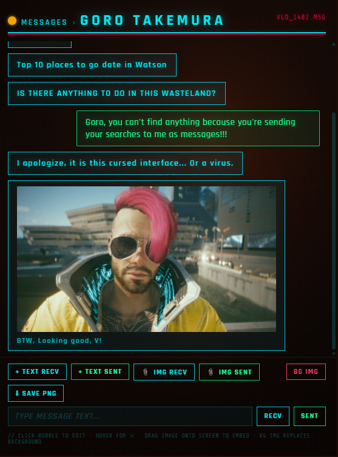
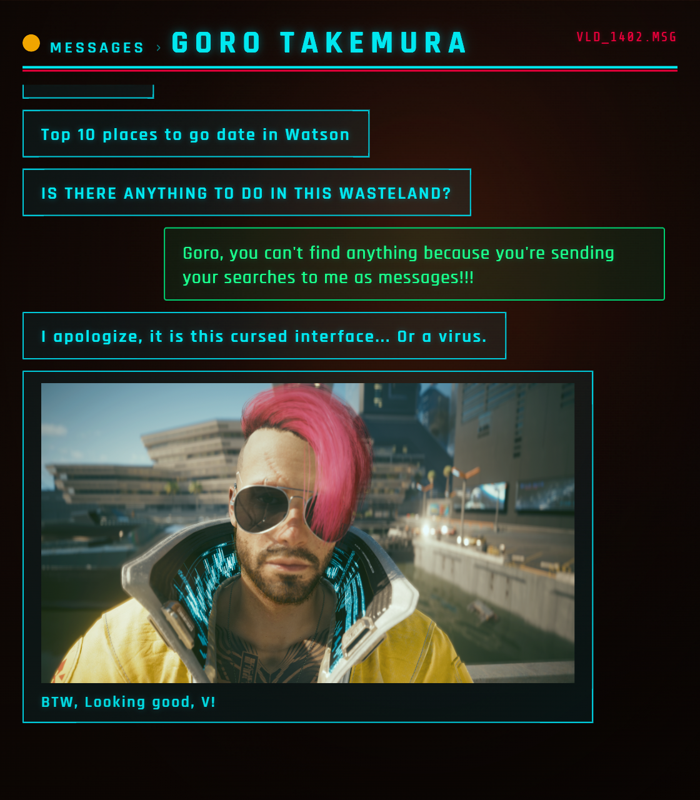

# Cyberpunk-Message-Simulator
A browser-based tool for creating fake in-world message screenshots in the style of Cyberpunk's messaging UI — built for use in Cyberpunk Red tabletop RPG sessions.

Craft NPC text threads, embed images, and export clean PNGs to use as player handouts or session props. No install, no server, no dependencies — just open the HTML file in any browser.

---
Screenshot of the UI:

Here is what a completed message looks like:

---

## Features

- **Editable header** — click the contact name or message ID to change them
- **Text bubbles** — add received (left/cyan) and sent (right/green) messages instantly
- **Image bubbles** — embed images via file picker or drag & drop, with optional captions
- **Custom background** — upload your own NPC portrait or scene image as the background
- **Per-bubble delete** — hover any bubble and hit ✕ to remove it
- **Clean PNG export** — saves just the message panel with all UI controls hidden
- **Fully offline** — single HTML file, runs in any modern browser

---

## How to Use

1. **Download** `cp-messages-v3.html` from the [Releases](../../releases) page
2. **Open** it in your browser — no install needed
3. **Edit the header** by clicking the contact name or the message ID (top right)
4. **Add messages** by typing in the input bar and clicking **RECV** or **SENT** (or press Enter for sent)
5. **Embed an image** using the **📎 IMG RECV** / **📎 IMG SENT** buttons, or drag an image anywhere onto the screen
   - Dropping on the **left half** creates a received bubble; dropping on the **right half** creates a sent bubble
   - Click the caption area below the image to add a label
6. **Change the background** with the **BG IMG** button — great for dropping in an NPC portrait
7. **Export** with **⬇ SAVE PNG** to get a clean image ready to share with your players

---

## Use Cases

- Generate fake NET message threads as player handouts
- Show NPC-to-NPC messages your players intercept during a run
- Create in-world evidence, blackmail, or clue props
- Drop in maps, photos, or documents as image attachments
- Screenshot and post in your group chat or VTT session

---

## Compatibility

Works in any modern browser (Chrome, Firefox, Edge, Safari). No internet connection required after the page loads — fonts load from Google Fonts on first use, but the tool functions without them.

---

## License

MIT — free to use, modify, and share.

---

*Built for the dark future. Night City never sleeps.*
